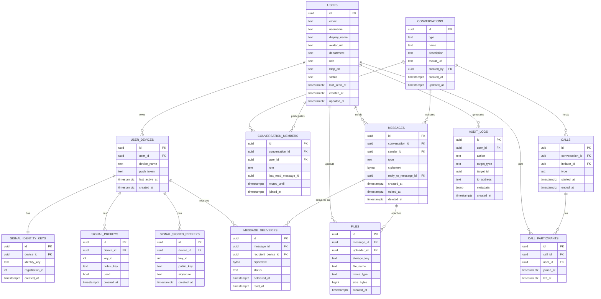

# Database Design — Internal Messenger App

PostgreSQL is the system of record (users, conversations, messages metadata, files,
calls, audit logs). Redis is used separately for presence, sessions, and ephemeral
caching — it is not modeled here.

> Note on E2E encryption: message **content** is end-to-end encrypted with libsignal,
> so the database never stores plaintext. `messages.ciphertext` and
> `message_deliveries.ciphertext` hold opaque encrypted blobs the server cannot read.

---

## ERD



---

## Table Notes

- **users** — Provisioned via LDAP sync or admin panel only (no public sign-up).
  `role` covers app-level roles (employee, admin); `department` mirrors the
  employee directory for org-chart features.
- **user_devices** — One row per logged-in device, needed because libsignal
  encrypts per-device, and for push notification tokens (FCM/APNs).
- **signal_identity_keys / signal_prekeys / signal_signed_prekeys** — Libsignal
  key bundles published by each device so other devices can establish encrypted
  sessions (X3DH key agreement).
- **conversations** — `type` is one of `direct`, `group`, `channel`. Direct chats
  have `name = NULL` (derived from the two members).
- **conversation_members** — `role` is `owner` / `admin` / `member` for
  groups, or `subscriber` for channels. `last_read_message_id` powers read
  receipts/unread counts.
- **messages** — Server-opaque ciphertext; `type` (`text`, `image`, `video`,
  `audio`, `file`, `system`) lets the client render correctly without decrypting.
- **message_deliveries** — One row per recipient device per message (Signal
  encrypts separately per device session). `status` tracks
  sent → delivered → read for the delivery-status feature.
- **files** — Metadata only; actual bytes live in MinIO under `storage_key`.
  Files are encrypted client-side before upload.
- **calls / call_participants** — Call history/logging for WebRTC sessions
  (1-on-1 and group via mediasoup).
- **audit_logs** — `target_type`/`target_id` form a polymorphic reference
  (e.g. `conversation`/`<uuid>`, `file`/`<uuid>`) for compliance exports.

---

## SQL DDL (PostgreSQL)

```sql
CREATE EXTENSION IF NOT EXISTS "uuid-ossp";

CREATE TYPE user_status AS ENUM ('active', 'disabled');
CREATE TYPE conversation_type AS ENUM ('direct', 'group', 'channel');
CREATE TYPE member_role AS ENUM ('owner', 'admin', 'member', 'subscriber');
CREATE TYPE message_type AS ENUM ('text', 'image', 'video', 'audio', 'file', 'system');
CREATE TYPE delivery_status AS ENUM ('sent', 'delivered', 'read');
CREATE TYPE call_type AS ENUM ('audio', 'video');

-- Users & devices

CREATE TABLE users (
    id              UUID PRIMARY KEY DEFAULT uuid_generate_v4(),
    email           TEXT UNIQUE NOT NULL,
    username        TEXT UNIQUE NOT NULL,
    display_name    TEXT NOT NULL,
    avatar_url      TEXT,
    department      TEXT,
    role            TEXT NOT NULL DEFAULT 'employee',
    ldap_dn         TEXT UNIQUE,
    status          user_status NOT NULL DEFAULT 'active',
    last_seen_at    TIMESTAMPTZ,
    created_at      TIMESTAMPTZ NOT NULL DEFAULT now(),
    updated_at      TIMESTAMPTZ NOT NULL DEFAULT now()
);

CREATE TABLE user_devices (
    id              UUID PRIMARY KEY DEFAULT uuid_generate_v4(),
    user_id         UUID NOT NULL REFERENCES users(id) ON DELETE CASCADE,
    device_name     TEXT NOT NULL,
    push_token      TEXT,
    last_active_at  TIMESTAMPTZ,
    created_at      TIMESTAMPTZ NOT NULL DEFAULT now()
);

CREATE INDEX idx_user_devices_user_id ON user_devices(user_id);

-- Signal protocol key bundles

CREATE TABLE signal_identity_keys (
    id              UUID PRIMARY KEY DEFAULT uuid_generate_v4(),
    device_id       UUID NOT NULL UNIQUE REFERENCES user_devices(id) ON DELETE CASCADE,
    identity_key    TEXT NOT NULL,
    registration_id INT NOT NULL,
    created_at      TIMESTAMPTZ NOT NULL DEFAULT now()
);

CREATE TABLE signal_signed_prekeys (
    id              UUID PRIMARY KEY DEFAULT uuid_generate_v4(),
    device_id       UUID NOT NULL REFERENCES user_devices(id) ON DELETE CASCADE,
    key_id          INT NOT NULL,
    public_key      TEXT NOT NULL,
    signature       TEXT NOT NULL,
    created_at      TIMESTAMPTZ NOT NULL DEFAULT now(),
    UNIQUE (device_id, key_id)
);

CREATE TABLE signal_prekeys (
    id              UUID PRIMARY KEY DEFAULT uuid_generate_v4(),
    device_id       UUID NOT NULL REFERENCES user_devices(id) ON DELETE CASCADE,
    key_id          INT NOT NULL,
    public_key      TEXT NOT NULL,
    used            BOOLEAN NOT NULL DEFAULT FALSE,
    created_at      TIMESTAMPTZ NOT NULL DEFAULT now(),
    UNIQUE (device_id, key_id)
);

-- Conversations

CREATE TABLE conversations (
    id              UUID PRIMARY KEY DEFAULT uuid_generate_v4(),
    type            conversation_type NOT NULL,
    name            TEXT,
    description     TEXT,
    avatar_url      TEXT,
    created_by      UUID REFERENCES users(id),
    created_at      TIMESTAMPTZ NOT NULL DEFAULT now(),
    updated_at      TIMESTAMPTZ NOT NULL DEFAULT now()
);

CREATE TABLE conversation_members (
    id                   UUID PRIMARY KEY DEFAULT uuid_generate_v4(),
    conversation_id      UUID NOT NULL REFERENCES conversations(id) ON DELETE CASCADE,
    user_id              UUID NOT NULL REFERENCES users(id) ON DELETE CASCADE,
    role                 member_role NOT NULL DEFAULT 'member',
    last_read_message_id UUID,
    muted_until          TIMESTAMPTZ,
    joined_at            TIMESTAMPTZ NOT NULL DEFAULT now(),
    UNIQUE (conversation_id, user_id)
);

CREATE INDEX idx_conversation_members_user_id ON conversation_members(user_id);

-- Messages & deliveries

CREATE TABLE messages (
    id                   UUID PRIMARY KEY DEFAULT uuid_generate_v4(),
    conversation_id      UUID NOT NULL REFERENCES conversations(id) ON DELETE CASCADE,
    sender_id            UUID NOT NULL REFERENCES users(id),
    type                 message_type NOT NULL DEFAULT 'text',
    ciphertext           BYTEA NOT NULL,
    reply_to_message_id  UUID REFERENCES messages(id),
    created_at           TIMESTAMPTZ NOT NULL DEFAULT now(),
    edited_at            TIMESTAMPTZ,
    deleted_at           TIMESTAMPTZ
);

CREATE INDEX idx_messages_conversation_id_created_at ON messages(conversation_id, created_at);

CREATE TABLE message_deliveries (
    id                   UUID PRIMARY KEY DEFAULT uuid_generate_v4(),
    message_id           UUID NOT NULL REFERENCES messages(id) ON DELETE CASCADE,
    recipient_device_id  UUID NOT NULL REFERENCES user_devices(id) ON DELETE CASCADE,
    ciphertext           BYTEA NOT NULL,
    status               delivery_status NOT NULL DEFAULT 'sent',
    delivered_at         TIMESTAMPTZ,
    read_at              TIMESTAMPTZ,
    UNIQUE (message_id, recipient_device_id)
);

CREATE INDEX idx_message_deliveries_recipient ON message_deliveries(recipient_device_id, status);

-- Files

CREATE TABLE files (
    id              UUID PRIMARY KEY DEFAULT uuid_generate_v4(),
    message_id      UUID REFERENCES messages(id) ON DELETE CASCADE,
    uploader_id     UUID NOT NULL REFERENCES users(id),
    storage_key     TEXT NOT NULL,
    file_name       TEXT NOT NULL,
    mime_type       TEXT NOT NULL,
    size_bytes      BIGINT NOT NULL,
    created_at      TIMESTAMPTZ NOT NULL DEFAULT now()
);

CREATE INDEX idx_files_message_id ON files(message_id);

-- Calls

CREATE TABLE calls (
    id              UUID PRIMARY KEY DEFAULT uuid_generate_v4(),
    conversation_id UUID NOT NULL REFERENCES conversations(id) ON DELETE CASCADE,
    initiator_id    UUID NOT NULL REFERENCES users(id),
    type            call_type NOT NULL,
    started_at      TIMESTAMPTZ NOT NULL DEFAULT now(),
    ended_at        TIMESTAMPTZ
);

CREATE TABLE call_participants (
    id              UUID PRIMARY KEY DEFAULT uuid_generate_v4(),
    call_id         UUID NOT NULL REFERENCES calls(id) ON DELETE CASCADE,
    user_id         UUID NOT NULL REFERENCES users(id),
    joined_at       TIMESTAMPTZ NOT NULL DEFAULT now(),
    left_at         TIMESTAMPTZ
);

-- Audit logs

CREATE TABLE audit_logs (
    id              UUID PRIMARY KEY DEFAULT uuid_generate_v4(),
    user_id         UUID REFERENCES users(id),
    action          TEXT NOT NULL,
    target_type     TEXT,
    target_id       UUID,
    ip_address      TEXT,
    metadata        JSONB,
    created_at      TIMESTAMPTZ NOT NULL DEFAULT now()
);

CREATE INDEX idx_audit_logs_user_id_created_at ON audit_logs(user_id, created_at);
```
